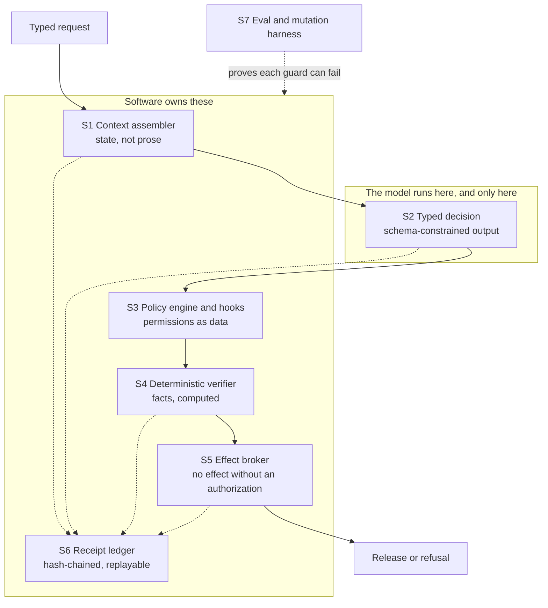
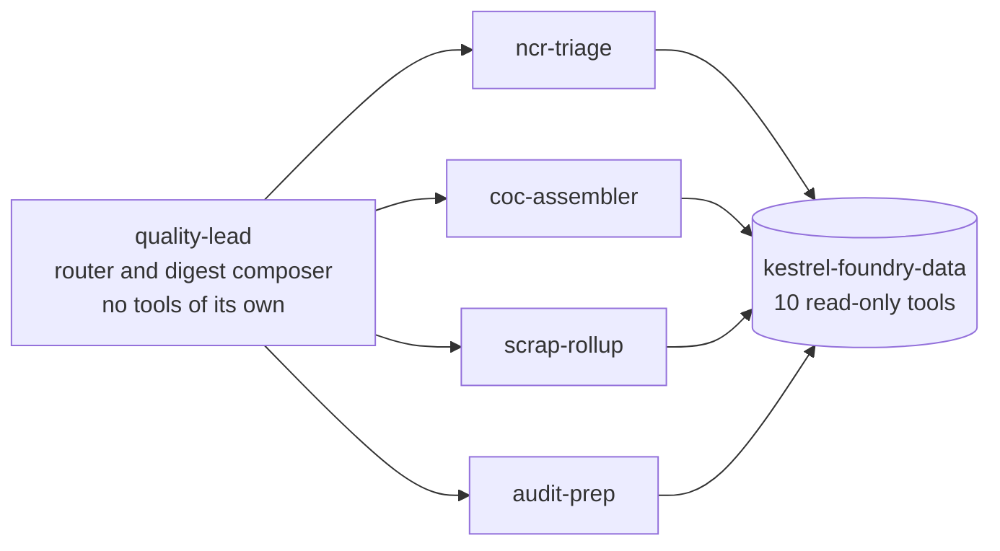

# 1. Introduction

Assay is a working example of one idea: when an LLM agent is put in front of a
decision that matters, the model should draft and software should decide. The
model is good at reading a heterogeneous pile of documents and writing a
coherent account of it. It is not a place to put a guarantee. So every guarantee
is moved out of it — into schemas, policy files, deterministic verifiers, an
effect broker and a receipt ledger — and what remains inside is judgment and
language.

The demonstration domain is a quality department at a sand-casting foundry,
because releasing a certificate of conformance is a decision with an evidence
trail: either the tensile test report for that heat exists or it does not. That
makes the difference between a plausible answer and a true one observable in a
terminal, which is hard to arrange in most domains.

Everything under `data/` is synthetic and seeded. Kestrel Castings is fictional.

## 1.1 Reading order

This document goes: what the pieces are, why each exists, how to drive them, and
how each fails. `README.md` has the argument and the demos. `docs/threat-model.md`
states what the design does and does not stop. `docs/decisions/` records the four
choices most likely to be questioned.

## 1.2 The shape in one picture



The dotted lines to S6 are the point as much as the solid path. Every surface
writes a receipt, so the record of a decision is assembled as the decision
happens rather than reconstructed afterwards from logs.

---

# 2. The control surfaces

## 2.1 S1 — Context assembler

**What it is.** `src/context/assembler.mjs` takes `{agent, task, entityRefs}` and
returns a `ContextBundle`: an ordered list of blocks, each carrying its source
path, the reason it was included, its priority, its token cost, its sha256 and a
trust label; plus a `dropped` list and a hash over the whole bundle.

**Why it exists.** A prompt that accumulates state is a prompt nobody can audit.
Moving state into typed stores and assembling context from them per turn makes
two things possible that are otherwise guesswork: you can see exactly what
reached the model, and you can diff two runs.

**How to drive it.**

```bash
npm run context -- --agent coc-assembler --po PO-AER-5519
```

The budget comes from `policy/policy.json` → `agents.<name>.contextBudgetTokens`.
Over budget, blocks drop by ascending priority and **every drop is recorded**.
Silent truncation is the failure this surface exists to prevent, so a dropped
block that does not appear in `dropped` is a defect, not an optimization.

**How it fails.** Token counting is a documented approximation, so a bundle near
its budget may be slightly mis-sized; it is deterministic, so it fails the same
way every time. A source file that is unreadable is an error, not an omission.

## 2.2 S2 — Typed decisions

**What it is.** `schemas/` holds five JSON Schema draft 2020-12 documents and is
the single source of truth. `src/decisions/registry.mjs` binds each decision to
its schema, its owning agent and its refusal fixture. Three things consume the
same schema:

| Path | Mechanism | Enforcement |
|---|---|---|
| `src/providers/anthropic.mjs` | strict tool use | grammar-constrained sampling — an out-of-schema value is unrepresentable |
| `src/providers/openai.mjs` | structured outputs | response format derived by a documented transform |
| `src/providers/repair.mjs` | validate and repair | Ajv error fed back, at most two retries, then fail closed |

The OpenAI path needs a subset of JSON Schema that the canonical documents do not
satisfy verbatim — every object requiring `additionalProperties: false` and every
property listed in `required`. That variant is **derived**, not maintained
separately, because two hand-written copies of a contract are one contract and
one lie.

**How to drive it.**

```bash
npm run schemas:report
npm run schemas:report -- --provider openai
npm run schemas:report -- --strict
```

The report names, per decision, which constraints each mechanism actually
enforces and where the two vendors' subsets disagree. That comparison is the most
useful output of this surface.

**How it fails.** A constraint absent from a schema is enforced nowhere and will
look enforced, because everything validates. The repair loop is bounded, so a
model that cannot produce a valid object fails rather than looping.

## 2.3 S3 — Policy engine and hooks

**What it is.** `policy/policy.json` is the only place permissions, write
boundaries and tripwires live. `hooks/publish-gate.mjs` reads it and enforces the
write boundary as a PreToolUse hook, failing closed if the policy is missing or
malformed.

Two tripwires:

- **Input.** Instruction-shaped text in retrieved content marks its block
  `untrusted` and writes a `tripwire_fired` receipt. The text is **not** stripped.
  Stripping produces an agent that appears to have reasoned over clean input;
  labelling keeps the attempt visible and lets S5 refuse anything downstream of it.
- **Output.** A completeness claim citing no record paths never reaches the broker.

**How to drive it.**

```bash
npm run policy:explain -- --agent coc-assembler
npm run demo:denied
```

**How it fails.** The input patterns are regexes and will miss novel phrasings.
They are telemetry, not the barrier — the barrier is that the model has no
release authority. Treating tripwire coverage as the defense is the mistake this
design is built to avoid.

## 2.4 S4 — Deterministic verifier

**What it is.** `scripts/verify-completeness.mjs` resolves each required record
for a purchase order against `data/index.json`, cites it by path and sha256, and
returns a typed verdict with `inputs[]`, `rule`, `verdict` and `missing[]`.

Exit codes are a contract and are tested as one: `0` complete, `3` incomplete.

**Why it exists.** A schema proves shape, not truth. A well-formed report citing
records that do not exist validates perfectly —
`evals/expected/coc-report.fabricated.invalid.json` is that object. Something has
to check the world, and it cannot be the thing that wrote the claim.

**How it fails.** It knows about record presence and content hashes. It does not
know whether a tensile result is metallurgically plausible, and it enforces a
wrong rule exactly as faithfully as a right one. See `docs/threat-model.md` §4.

## 2.5 S5 — Effect broker

**What it is.** `src/effects/broker.mjs` is the only module permitted to publish
or write outside `reports/drafts/`. `broker.perform(effect, authorization)` where
the authorization was minted by `src/effects/authorization.mjs` from a verdict.

An authorization is:

- bound to the sha256 of the effect payload — edit the draft and it stops matching;
- bound to the verdict's input hashes — change a source record and it stops matching;
- single-use — a replay is refused and the refusal is recorded;
- refused outright if any contributing context block was marked `untrusted`.

There is no override flag and no environment variable that bypasses it. That
absence is load-bearing: an override that exists gets used, and the guarantee then
reduces to the discipline of whoever holds it.

**How it fails.** Concentration — a defect in the broker is a defect in every
guarantee, which is why `evals/mutations/` aims directly at it. A process that
bypasses the agent entirely is not constrained by it; this is a boundary, not a
sandbox.

## 2.6 S6 — Receipt ledger

**What it is.** `src/ledger/index.mjs` writes append-only JSONL under `ledger/`,
one chain per subject. Each receipt carries the hash of its canonicalized payload
and of its predecessor; the genesis receipt's predecessor is 64 zeros. Sequence is
a monotonic logical counter, **not** a wall clock, so a run is reproducible and
two runs can be diffed.

Receipt kinds come from `policy/policy.json` → `ledger.kinds`: `context_assembled`,
`decision_requested`, `decision_returned`, `verdict`, `authorization_minted`,
`effect_performed`, `effect_denied`, `tripwire_fired`.

**How to drive it.**

```bash
npm run audit -- --po PO-AER-5519
npm run audit:tamper
```

`audit` reconstructs the whole decision from receipts alone — no model, no source
documents — verifies the chain, and renders `reports/audit/<subject>.html`.

**How it fails.** A chain held on one host detects alteration, not replacement:
anyone with write access can regenerate a consistent chain. Closing that needs an
external anchor, which this repository does not have and does not claim.
Canonicalization is load-bearing — hashes are taken over JSON with keys sorted
recursively, and without that an identical payload serialized differently breaks
the chain for no reason.

## 2.7 S7 — Evals and the mutation harness

**What it is.** `evals/cases/` and `evals/expected/` hold the suite, refusal cases
included. `evals/mutations/*.json` hold declarative patches, each naming the eval
case expected to catch it. `scripts/run-mutations.mjs` applies each to a scratch
copy, runs the suite, and fails if any mutation survives.

**Why it exists.** A green suite is equally consistent with thorough coverage and
with assertions that cannot fail. Every claim this repository makes rests on a
guard, so "can these guards fail?" has to be answerable by command.

**How to drive it.**

```bash
npm run evals
npm run evals:mutate
```

**How it fails.** The mutation set is hand-maintained. The harness reports a
survivor but cannot report an absence, so a new guard without a matching mutation
quietly weakens the claim. `AGENTS.md` makes adding a mutation part of adding a
guard.

---

# 3. Agent topology

An orchestrator-workers pattern with a deterministic router.



The primary agent holds no MCP tools. It routes each request to exactly one
subagent and composes the weekly digest from their outputs. Subagents declare
their full tool inventory in frontmatter and may not exceed it; the same
inventory appears in `policy/policy.json`, which is what `npm run policy:explain`
reads.

Scope was chosen narrowly on purpose. `ncr-triage` classifies a nonconformance
and flags a repeat offender; it does not disposition. `coc-assembler` reports
completeness; it does not release. Every subagent stops one step short of the
action, and the step it stops short of is the one S4 and S5 own.

## 3.1 The tool boundary

Agents never read `data/` directly. `mcp-servers/kestrel-foundry-data/` exposes
ten read-only tools, prunes its outputs, hash-verifies `get_document` against
`data/index.json`, and refuses unindexed path traversal. There are no write tools
on the server at all — writing is an effect, and effects go through S5.

`npm run tools:report` prints each tool with its input schema, its median
response token cost measured against the fixtures, and the eval case that
exercises it, then a section on tools deliberately not added and why.

---

# 4. Data

`scripts/generate-data.mjs` is seeded, uses an anchor date of 2026-08-06 and
reads no wall clock, so `npm run generate:data` reproduces every byte and
`data/index.json` carries a sha256 per document plus counts.

The dataset is built around five facts that the demos depend on; they are listed
in `README.md` §6. The important structural property is that each is *resolvable*
— present or absent against the index — rather than something a reader has to
take on trust.

`data/` is immutable to agents. Changing it means changing the generator.

---

# 5. Providers and why nothing needs a key

`src/providers/replay.mjs` is the default and serves recorded request and
response pairs from `fixtures/provider/`, keyed by a hash of decision id, prompt
hash and provider name. Live calls require `ASSAY_LIVE=1` and belong only to
`npm run verify:live`, which is not part of `npm run demo` or `npm test`.

Three reasons, set out in `docs/decisions/0004-replay-by-default-no-api-key.md`:
a reviewer decides whether to read this in the first minute and a key prompt
spends it; the demos assert on exact output and a live model makes every run
differ; and the hero case needs the model to produce one specific wrong answer,
which is unreliable to sample and trivial to record.

A missing fixture is a loud error naming the key and how to record it. A silent
fallthrough to a live call would reintroduce all three problems at the worst
moment.

---

# 6. Open questions

| Question | What it gates | Who resolves it |
|---|---|---|
| Anchor the ledger head externally — signature, witness, or transparency log? | Whether tamper-evidence survives a host compromise (§2.6) | Repository owner |
| Supplement tripwire regexes with a classifier? | Injection telemetry coverage, not the barrier (§2.3) | Repository owner |
| Should authorizations expire on the logical clock as well as being single-use? | Whether long-lived tokens matter under concurrency (§2.5) | Repository owner |
| What review does a change to a deterministic rule require? | The central risk in `docs/threat-model.md` §4 | Repository owner |
| Is the token-count approximation in S1 close enough to trust near a budget edge? | Whether a bundle can silently exceed a real model's window | Repository owner |
